# Loewe TVs Q2500 VGA Module
Recreation of VGA module PCB for Loewe TVs with Q2500M chassis.

Project based on work done by Oelii from [circuit-board.de/forum](https://circuit-board.de/forum/index.php/Thread/28516-WIP-DIY-Loewe-VGA-Modul-Q2500/)

Schematic recreated from the scratch in KiCad. PCB based on Oelii's layout and verified with Desing/Electrical Rules Checker tools.<br>
Components footprints replaced with KiCad standard ones.

## Chassis compatibility
Unverified, obtained from post by djcalle on [circuit-board.de/forum](https://circuit-board.de/forum/index.php/Thread/28516-WIP-DIY-Loewe-VGA-Modul-Q2500/?postID=906980#post906980):
- Q23, Q24, Q25 can accept VGA cards.
- Q25 and Q24 use the same VGA card (only 2 differences: cable length and 150R termination on RGB lines.)
- Q25 seems to be inconsistent with VGA card compatibility.
- Q24 seems consistent with vga card compatibility.
- Q23 uses its own [different card](https://github.com/proboterror/Loewe_VGA_Module_Q2300).

## EDID option
For widescreen TVs [EDID](https://en.wikipedia.org/wiki/Extended_Display_Identification_Data) EEPROM option can be installed and flashed, helping to automatically add 848x480@60Hz (CVT) default widescreen resolution.

Original schematic from [Loewe Q2500-M chassis service manual](doc/Q2500-M/Loewe%20Q2500M%20Service%20Manual.pdf)
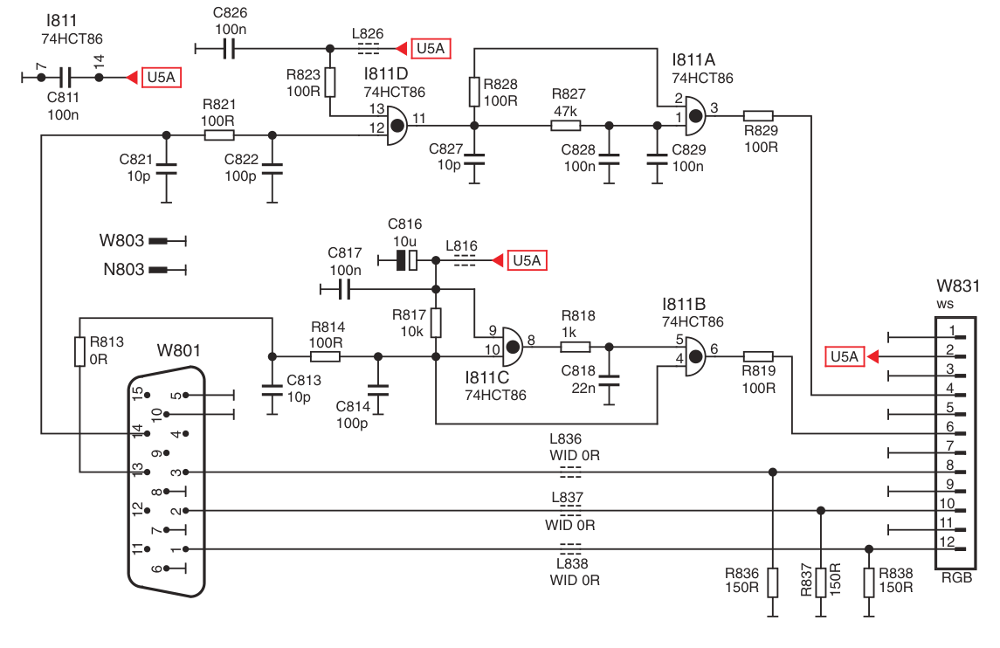

Recreated schematic and PCB
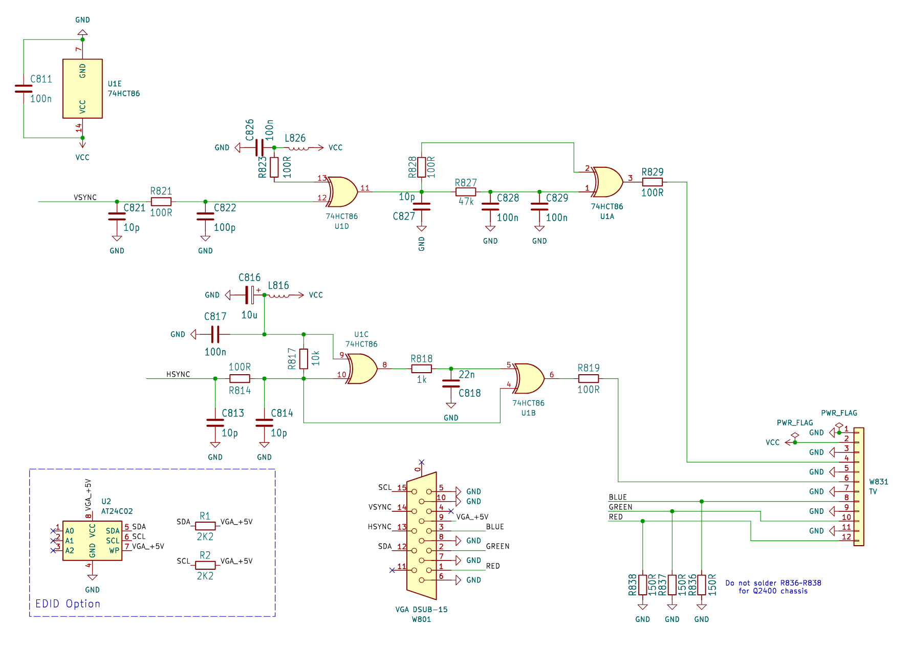
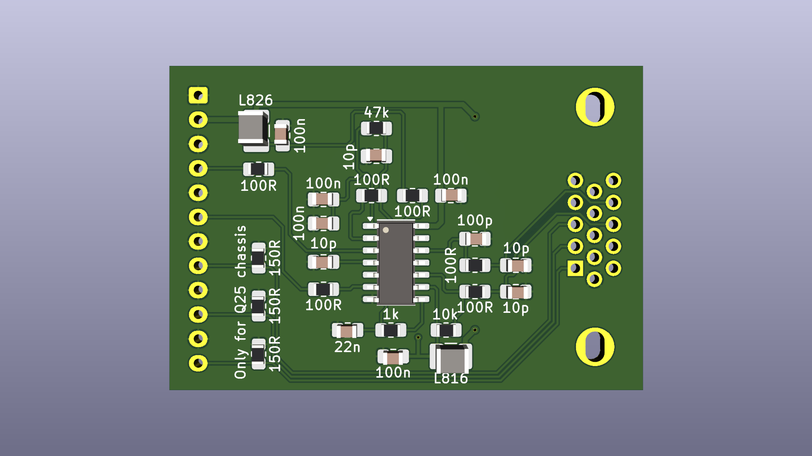
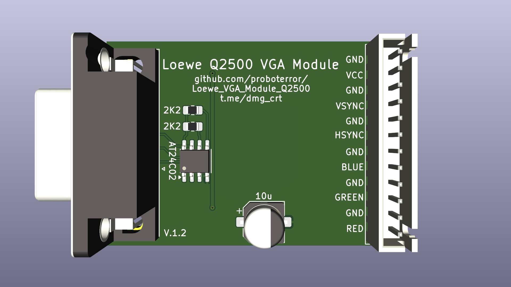
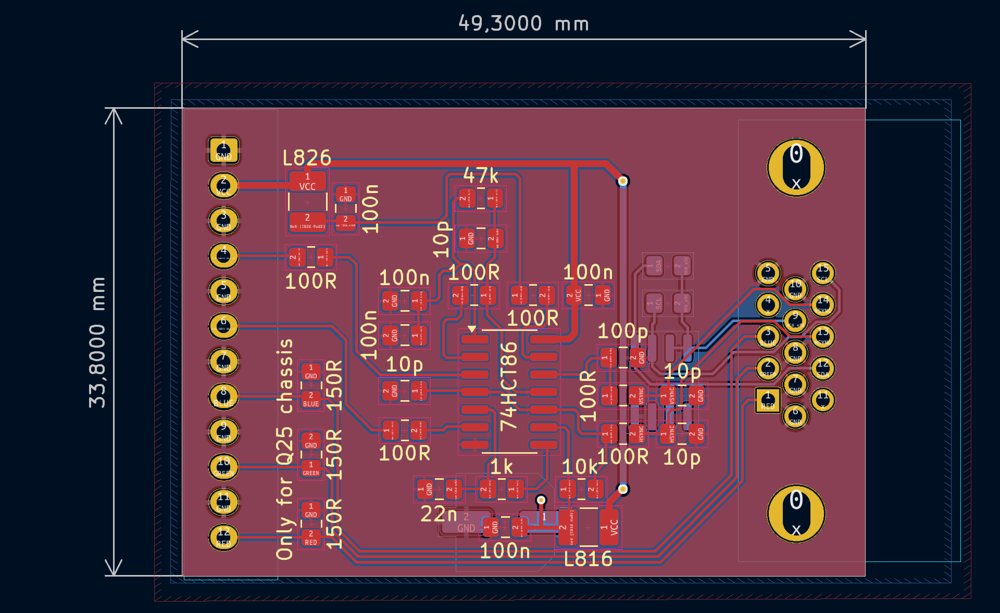

## Bill of materials
|Reference|Value|Footprint|Qty|
|-----|-----|-----|-----|
|C811,C817,C826,C828,C829|100n|0805|5|
|C813,C814,C821,C827|10p|0805|4|
|C816|10u|0805|1|
|C818|22n|0805|1|
|C822|100p|0805|1|
|L816,L826|1210(3225)|4.7uH|2|
|R814,R819,R821,R823,R828,R829|100R|0805|6|
|R817|10k|0805|1|
|R818|1k|0805|1|
|R827|47k|0805|1|
|R836,R837,R838|150R|0805|3|
|I811|74HCT86|SO-14|1|
|W801|VGA DSUB-15<br>Edge pin offset 8.35mm<br>Mounting holes offset 10.89mm ||1|
|W831|JST XH 2.54 12 Pin||1|
|U2|AT24C02 (EDID option)|SOIC-8|1|
|R1,R2|2K2 (EDID option)|0805|2|

## Order boards from manufacturer
Send "gerbers" folder content packed to zip archive.

## Build Notes
AT24C02 EEPROM and R1,R2 are EDID option, useful for connection widescreen models to PC/VGA.

L816 and L826 SMD 1210(3225) inductors value are unknown; 4.7uH in Q2300 VGA module schematic; can be replaced with 0R resistor.

W831 connector originally is Molex 22-23-2121. Probably can be replaced with XH 2.54 12 pin connectors / cables, note pins step 2.5/254 mm.
Pay attention on cable connectors type: same direction or reverse direction.
Most cable are up to 30 cm, sometimes 50 cm. Measure what you need before ordering. 

**Double-check ground and VCC connection on VGA module PCB and TV chassis before soldering 12-pin W831 connector and power on.**

## EDID ROM
[Extended Display Identification Data (EDID)](https://en.wikipedia.org/wiki/Extended_Display_Identification_Data) ROM sends display info to PC over VGA [I2C](https://en.wikipedia.org/wiki/I2C) [DDC (Display Data Channel)](https://en.wikipedia.org/wiki/Display_Data_Channel), such as supported / default resolutions, supported frequency ranges, physical dimensions and display name.

Standard VGA resolutions 640x400@70Hz and 640x480@60Hz marked as supported.<br>
Added custom default resolution 848x480@60Hz.<br>
Added modeline generated with [CVT](doc/VESA-CVT-1.2.pdf) formulas.<br>
Display reported as "Loewe CRT".

Generated [edid.bin](EDID/edid.bin) can be in-system programmed to AT24C02 EEPROM with CH341 (I2C) programmer, 8 pin chip clip and NeoProgrammer V2.2.0.10:
"IC/I2C/Generic/_24C02 [3.3V]" or "Detect", "File/Open" .bin, "Write IC" (Erase, Blank Check, Write, Verify).

[EDID 1.3](doc/VESA-EEDID-A1.pdf) display description ROM image in raw .hex format generated with [generate_edid.py](EDID/generate_edid.py) script.

Generate edid.hex:
```
python generate_edid.py > edid.hex
```
Convert raw .hex to .bin:
```
type edid.hex | xxd -r -p > edid.bin
```
To view generated display description:
```
edid-decode edid.bin
```

Conservative / more compatible custom modeline included by default:
```
Modeline "848x480_60" 31.75  848 864 944 1024  480 483 493 517 -hsync +vsync
```
Alternative modeline generated with cvt utility can be selected in generate_edid.py:
```
cvt 848 480 60
Modeline "848x480_60" 31.50  848 872 952 1056  480 483 493 500 -hsync +vsync
```

## Install
Q2400 chassis:
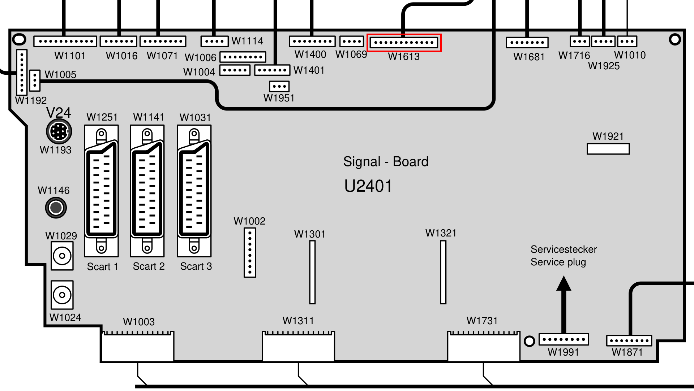

Q2500 chassis:
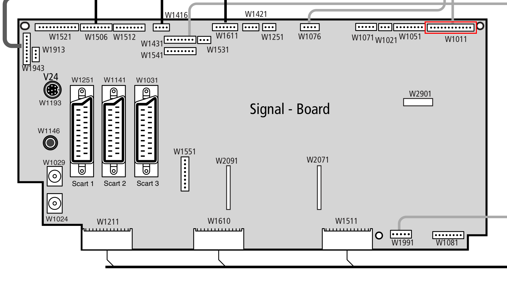

## Required TV and adapter board modifications
Mods information provided by @neonname.

Combined VGA adapter board output and TV input termination/load resistance for RGB lines should be ~75 Ohm.

### Q2400
TV Signal Board schematic:
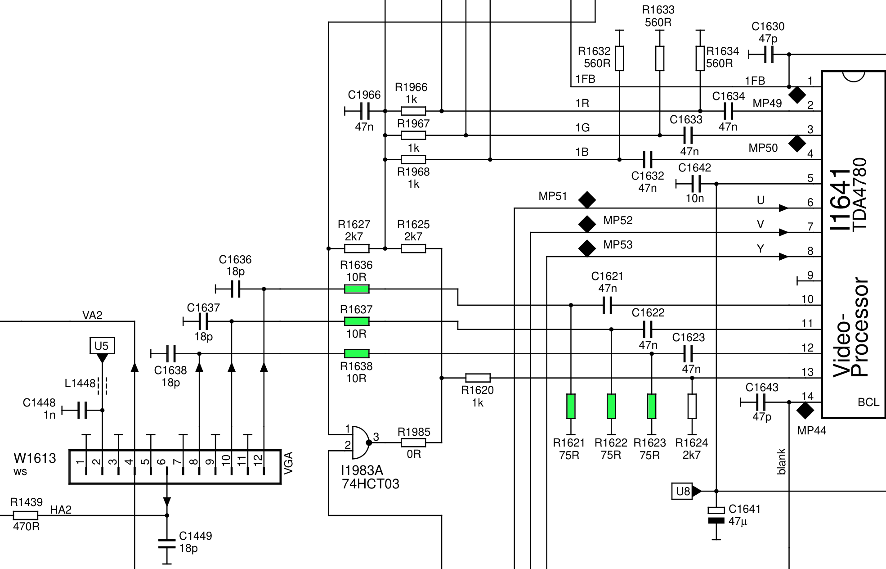
PCB components side:
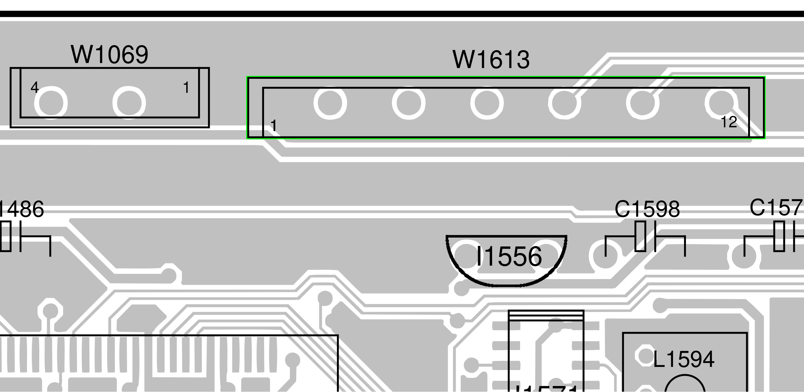
Q2400 signal board already have 75 Ohm termination resistors on RGB lines.<br>
150 Ohm RGB termination resistors on adapter board should be removed.
<hr>

### Q2500-B
TV Signal Board schematic:
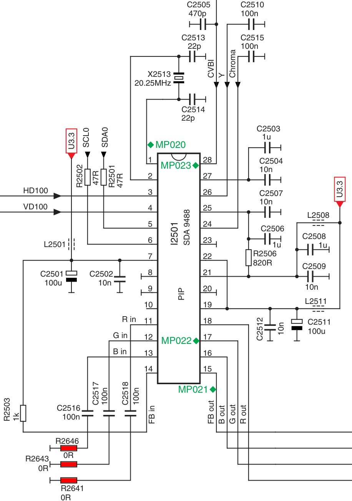
PCB components side:
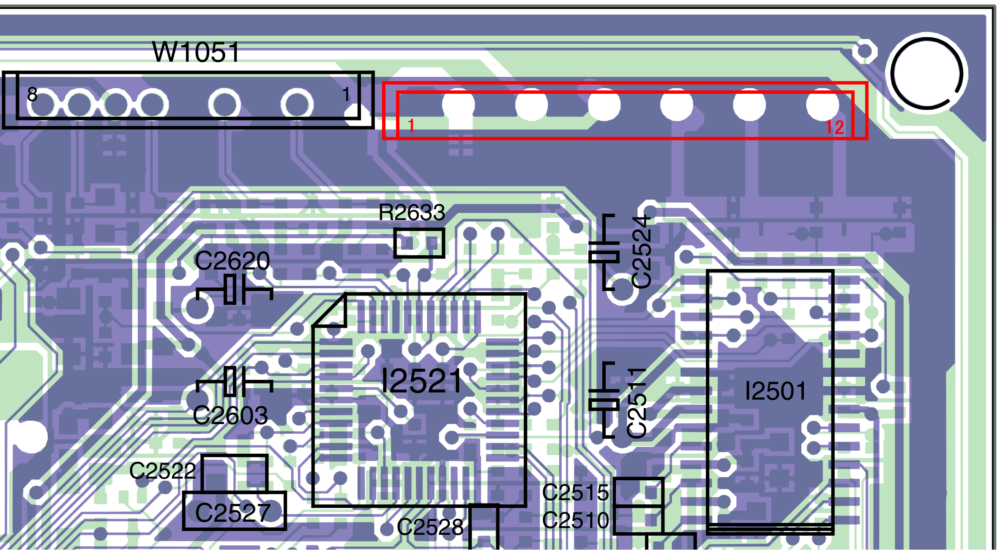
PCB solder side:
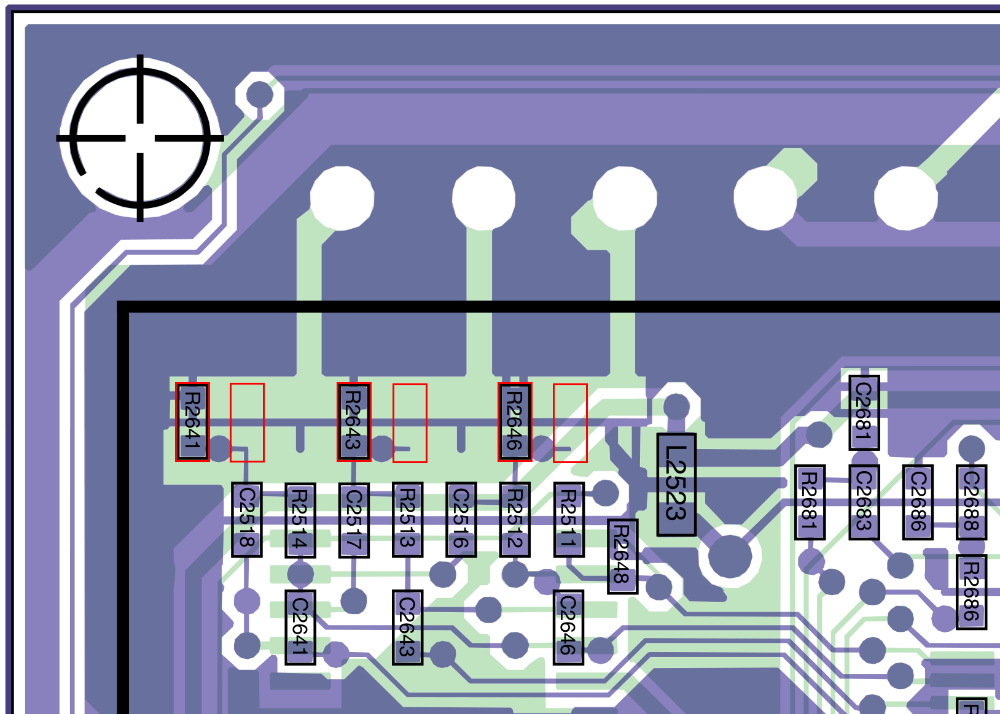
PCB missing W1011 VGA connector and RGB input resistors, RGB input connected to ground with 0R load resistors.<br>
Suggested changes, needs to check on real board:<br>
- Replaсe R2641, R2643, R2646 (0R) with 27R, add missing R1016, R1017, R1018 47R resistors (like Q2500-M) (probably incorrect termination)
- Or replaсe R2641, R2643, R2646 (0R) with 150R; add missing R1016, R1017, R1018 (0R) (like Q2500-H). Note: R2512, R2513, R2514.
<hr>

### Q2500-H
TV Signal Board schematic:
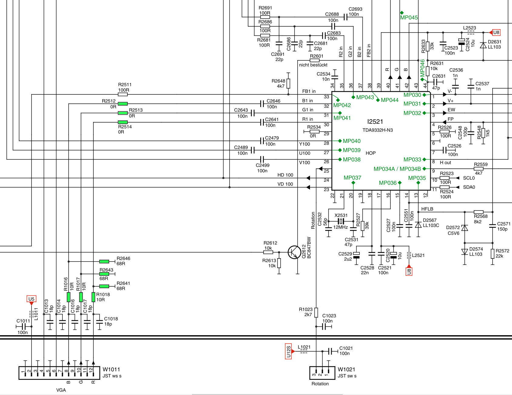
PCB components side:
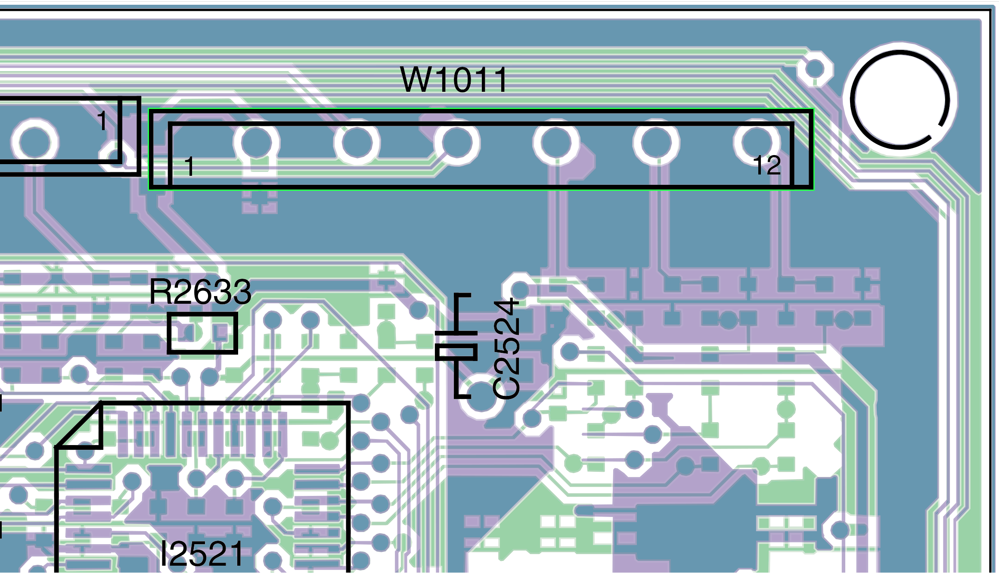
PCB solder side:
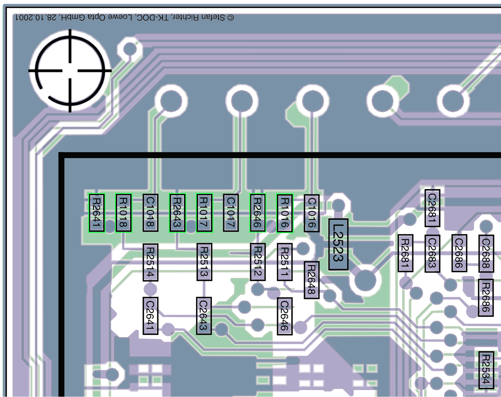
Recommended changes:<br>
- Replaсe R2641, R2643, R2646 (68R) with 150R; R1016, R1017, R1018 (10R) with 0R; R2512, R2513, R2514 (0R) with 47R; remove C1016, C1017, C1018.
<hr>

### Q2500-M
TV Signal Board schematic:
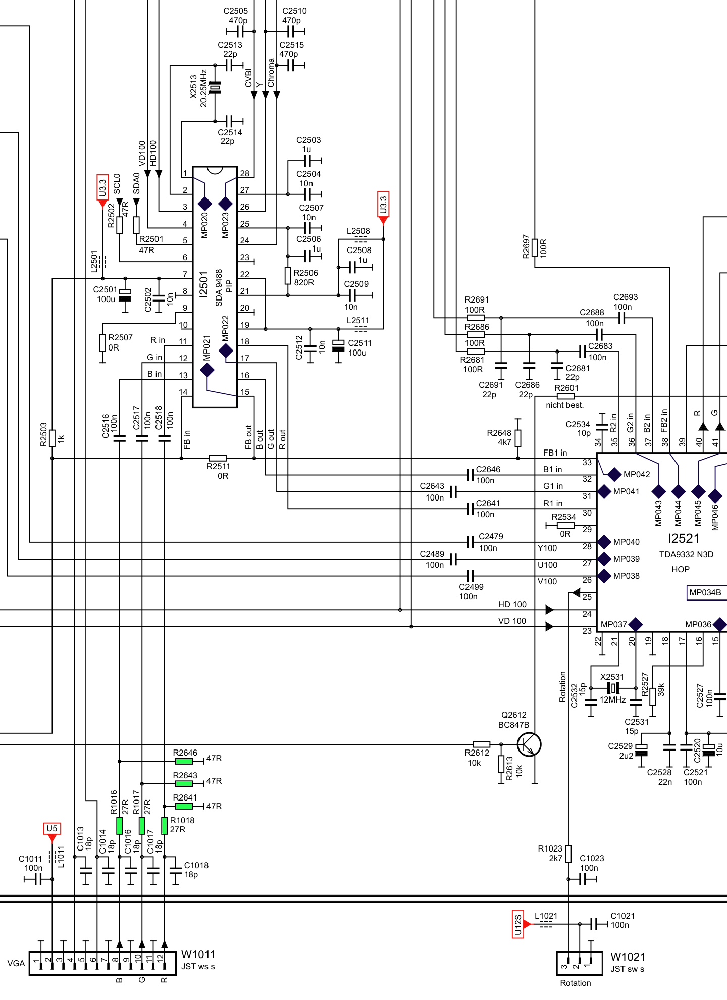
PCB components side:
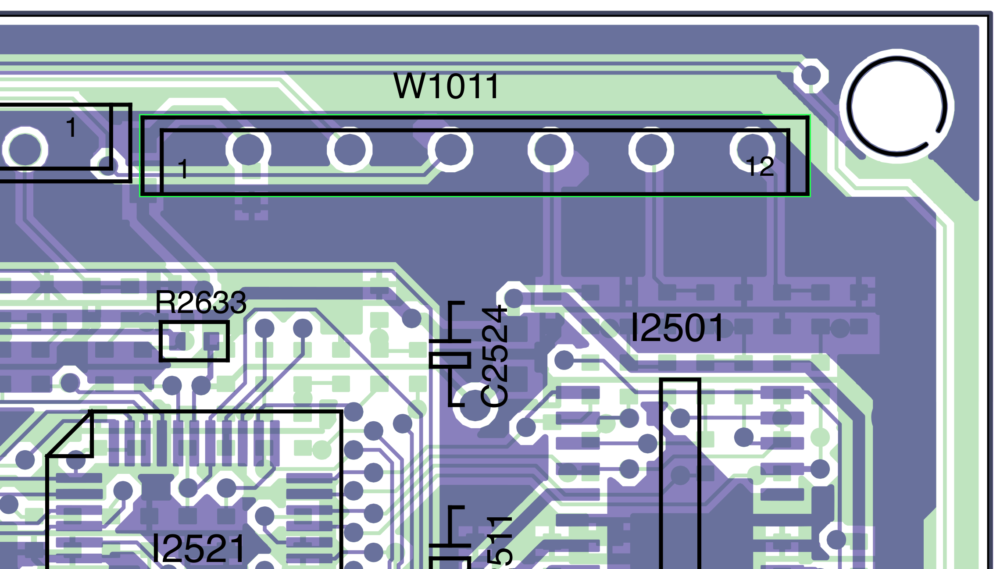
PCB solder side:
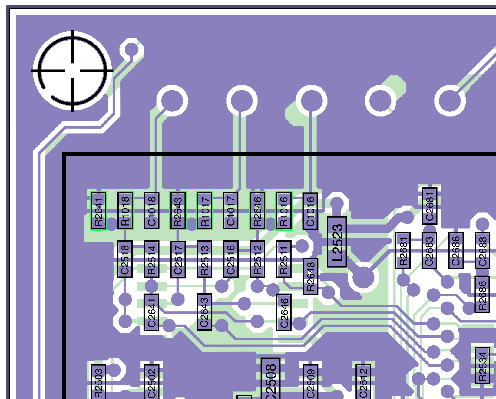
Suggested changes, needs to check on real board:<br>
- Replaсe R2641, R2643, R2646 (47R) with 150R; R1016, R1017, R1018 (27R) with 0R; remove C1016, C1017, C1018. Note: R2512, R2513, R2514.
<hr>