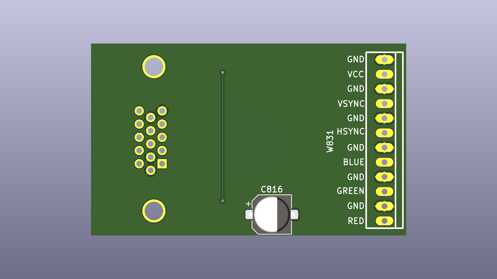

# Loewe TVs Q2500 VGA Module
Recreation of VGA module PCB for Loewe TVs with Q2500M chassis.

Project based on work done by Oelii from [circuit-board.de/forum](https://circuit-board.de/forum/index.php/Thread/28516-WIP-DIY-Loewe-VGA-Modul-Q2500/)

Schematic recreated from the scratch in KiCad. PCB based on Oelii's layout and verified with Desing/Electrical Rules Checker tools. 
Components footprints replaced with KiCad standard ones.

## Chassis compatibility
Unverified, obtained from post by djcalle on [circuit-board.de/forum](https://circuit-board.de/forum/index.php/Thread/28516-WIP-DIY-Loewe-VGA-Modul-Q2500/?postID=906980#post906980):
- Q23, Q24, Q25 can accept VGA cards.
- Q25 and Q24 use the same VGA card (only 2 differences: cable length and 150R termination on RGB lines.)
- Q25 seems to be inconsistent with VGA card compatibility.
- Q24 seems consistent with vga card compatibility.
- Q23 uses its own [different card](https://github.com/proboterror/Loewe_VGA_Module_Q2300).

Original schematic from [Loewe Q2500M chassis service manual](doc/Loewe%20Q2500M%20Service%20Manual.pdf)

Recreated schematic and PCB

## Bill of materials
|Reference|Value|Footprint|Qty|
|-----|-----|-----|-----|
|C811,C817,C826,C828,C829|100n|0805|5|
|C813,C814,C821,C827|10p|0805|4|
|C816|10u|0805|1|
|C818|22n|0805|1|
|C822|100p|0805|1|
|L816,L826|1210(3225)|4.7uH|2|
|R814,R819,R821,R823,R828,R829|100R|0805|6|
|R817|10k|0805|1|
|R818|1k|0805|1|
|R827|47k|0805|1|
|R836,R837,R838|150R|0805|3|
|I811|74HCT86|SO-14|1|
|W801|VGA DSUB-15 Edge pin offset 8.35mm Mounting holes offset 10.89mm ||1|
|W831|Molex 22-23-2121 XH 2.54 12 Pin||1|

## Order boards from manufacturer
Send "gerbers" folder content packed to zip archive.

## Build Notes
L816 and L826 SMD 1210(3225) inductors value are unknown; 4.7uH in Q2300 VGA module schematic; can be replaced with 0R resistor.

W831 connector originally is Molex 22-23-2121. Probably can be replaced with XH 2.54 12 pin connectors / cables, note pins step 2.5/254 mm.
Pay attention on cable connectors type: same direction or reverse direction.
Most cable are up to 30 cm, sometimes 50 cm. Measure what you need before ordering. 

**Double-check ground and VCC connection on VGA module PCB and TV chassis before soldering 12-pin W831 connector and power on.**

## Install
Q2400 chassis:

Q2500 chassis:
